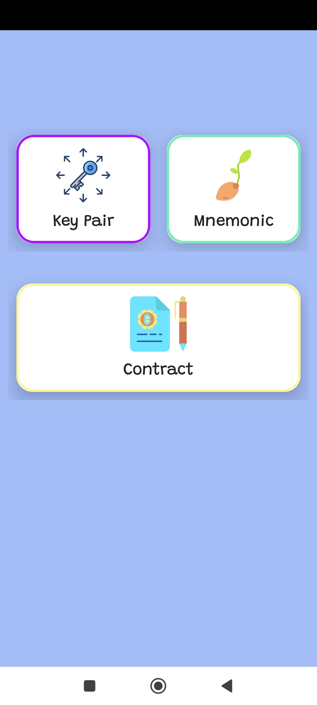
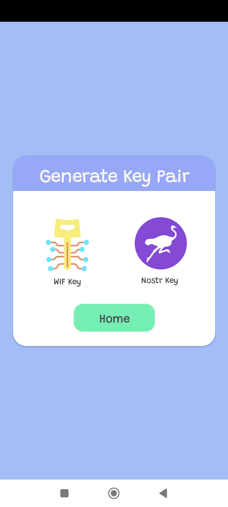
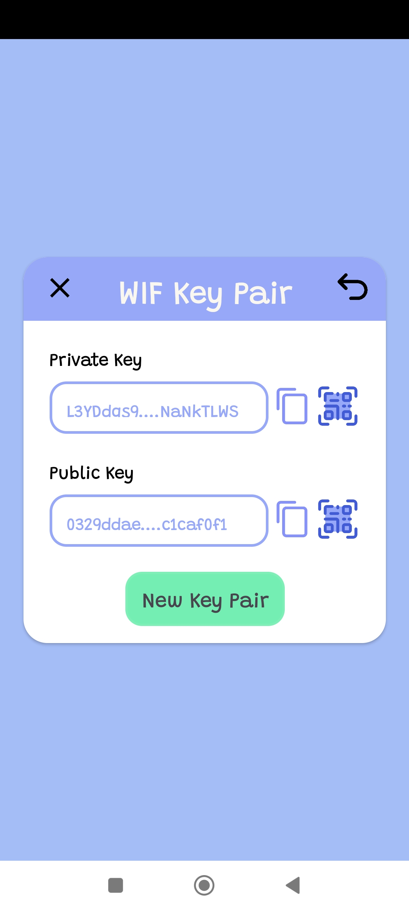
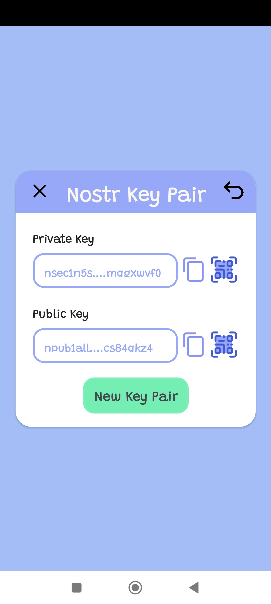
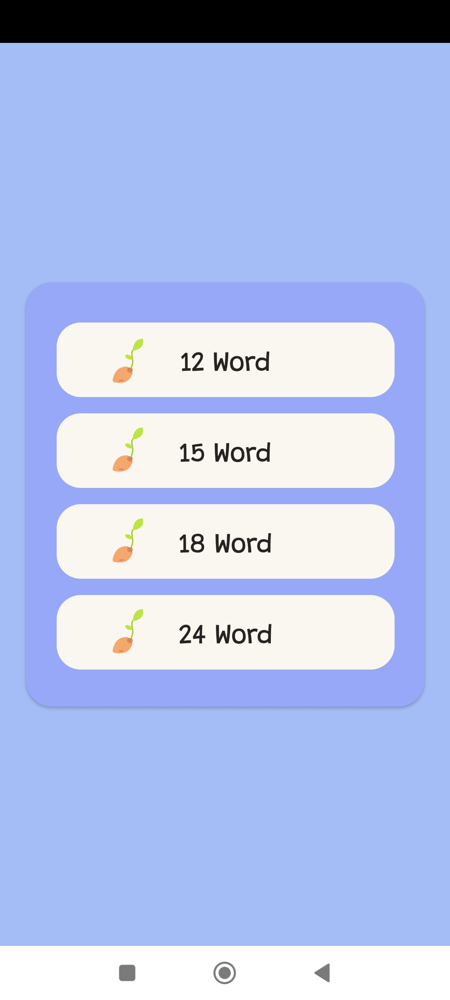
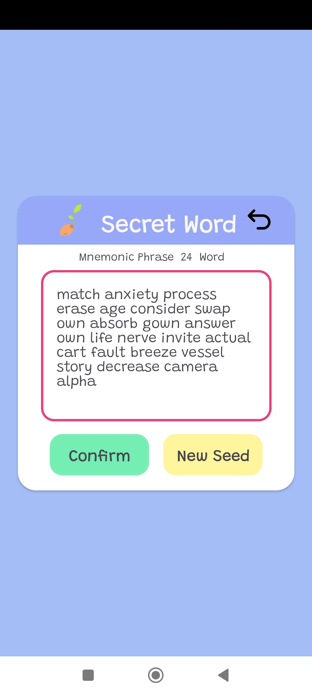
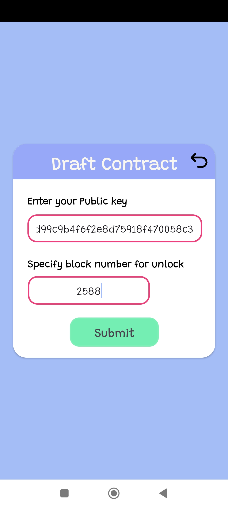
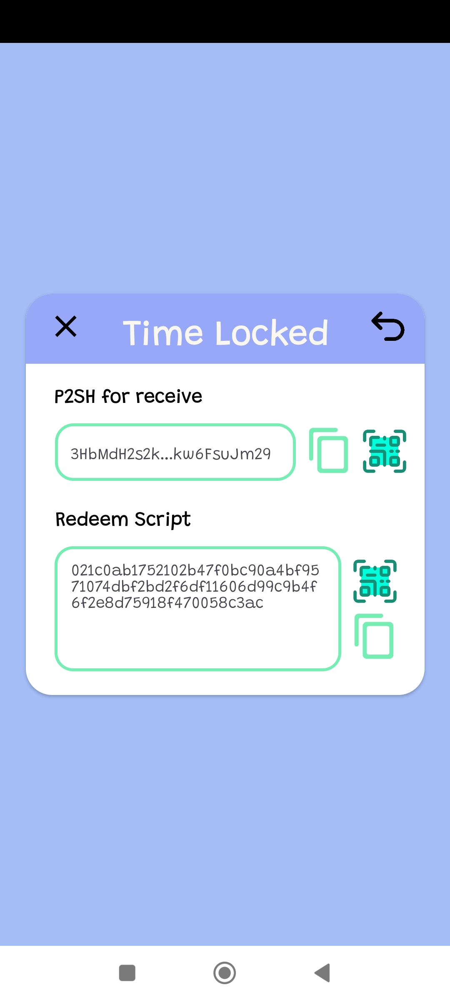

# _GENESEC_

> _แอพพลิเคชั่นสำหรับมือถือสำหรับ Android_

    

# ความสามารถของตัวแอพนี้

1. ใช้ในการสร้างคู่กุญแจของ Bitcoin กับ Nostr 
2. สร้าง mnemonic (BIP39) และมีตัวเลือกจำนวนคำที่ต้องการ
3. รอบรับการเขียน smart contract สำหรับ Bitcoin รูปแบบ time lock (ยังไม่ได้ทำฟังก์ชั่นสำหรับการปลกล็อคเงิน)

### Screenshot

    
    
    

    
    

    
    

